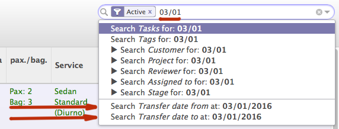

Managing views
**************

.. highlight:: xml

Creating tree and connecting it with menu
=========================================

Complete example which adds Menu (on the left) and Action (on the right or in center)::

    <?xml version="1.0"?>
    <openerp>
        <data>
        
            <record id="zero_kit_products_view" model="ir.ui.view">
                <field name="name">zero.kit.products.view</field>
                <field name="model">zero.products</field>
                <field name="type">form</field>
                <field name="arch" type="xml">
                    <form col="6" string="Upload Sale Order Report">
                        <field name="message" nolabel="True" readonly="True" colspan="5" />
                        <separator colspan="5" string=""/>
                        <group col="6" fill="0" states="start">
                            <button special="cancel" icon="gtk-cancel" string="Cancel"/>
                            <button type="object" name="zero_kit" icon="gtk-go-forward" string="Start"/>
                        </group>
                        <group col="5" fill="0" height="100" states="end">
                            <group colspan="5">
                                <button icon="gtk-ok" special="cancel" string="Chiudi"/>
                            </group>
                            <field invisible="1" name="state"/>
                        </group>
                    </form>
                </field>
            </record>

            <record id="action_zero_kit" model="ir.actions.act_window">
                <field name="name">Set Kit to Zero</field>
                <field name="res_model">zero.products</field>
                <field name="view_type">form</field>
                <field name="view_mode">tree,form</field>
                <field name="view_id" ref="zero_kit_products_view"/>
                <field name="target">new</field>
            </record>
            
            <!-- Action Definition -->
            <record id="action_menu_zero_kit" model="ir.values">
                <field name="object" eval="True" />
                <field name="name">Zero Kit Menu</field>
                <field name="key2">client_action_multi</field>
                <field name="value" eval="'ir.actions.act_window,' + str(ref('action_zero_kit'))" />
                <field name="key">action</field>
                <field name="model">stock.inventory</field>
            </record>

            <!-- Menu Definitions -->
            <menuitem id="inventory_mangement" name="Inventory" parent="stock.menu_stock_configuration"/>
            <menuitem id="zero_kit_menu" name="Zero Kit" parent="inventory_mangement" action="action_zero_kit"/>

        </data>
    </openerp>

Defining a tree inside a form
=============================

::

    <field name="work_order_default_task_ids" colspan="4" nolabel="1">
        <tree string="Default Work Order Tasks">
            <field name="name" colspan="4"/>
            <field name="planned_hours"/>
        </tree>
    </field>

Showing elements dependent on condition
=======================================

An element can be hidden or shown when a condition happens::

    <field name="pp" attrs="{'invisible': [('is_hidden', '=', True)]}" colspan="1" />

This can also be used to hide an entire tab::

    <page string="Bom" attrs="{'invisible': [('with_bom', '=', False)]}">
        <field colspan="4" name="mrp_bom" nolabel="1" widget="one2many_list"> 
            <tree string="Bom Line" editable="top" >
                <field name="product_id" required="True" />
                <field name="name" required="True" />    
                <field name='product_uom' />
                <field name='product_uom_qty' />
                <field name='price_unit' />
            </tree>
        </field>
    </page>

'states' and 'invisible' attributes
-----------------------------------

We can show parts of the view depending on **states** attribute::

    <button name="executed" states="wait_executed" string="Order Executed" class="oe_highlight"  groups="base.group_user"/>

This produce a domain expression telling to show the button, when *state* **not in** *wait_executed* state.

If we need to make a decision to show or to hide the element based not only on state, but also on some other element, we should remember, that state part is appended **after** all other expressions. For example if we want to show a button only when *state* is **wait_payed** and *payed* is **True**::

    <button name="payed" states="wait_payed" string="Order Payed" attrs="{'invisible': ['|', ('payed', '=', False)]}" class="oe_highlight"  groups="base.group_user"/>

This will produce an expression::

    {'invisible': ['|', ('payed', '=', False), ('state', 'not in', ['wait_payed'])]}

.. note:: When using more than one state, don't leave a space after coma. This **WILL NOT** work: states="wait_executed, done". This **WILL** work ok: states="wait_executed,done"

Extending existing view
=======================

You can create a view that extends existing view. What view we are going to extend is determined by `inherit_id`::
    
    <?xml version="1.0" ?>
    <openerp>
        <data>
            <record id="view_account_position_exemption_form" model="ir.ui.view">
                <field name="name">account.fiscal.position.exemption.form</field>
                <field name="model">account.fiscal.position</field>
                <field name="inherit_id" ref="account.view_account_position_form"/>
                <field name="type">form</field>
                <field name="arch" type="xml">
                    <field name="active" position="after">
                        <field name="is_tax_exemption" />
                    </field>
                </field>
            </record>
        </data>
    </openerp>

Sometime we need to give a complete path::

    <?xml version="1.0"?>
    <openerp>
        <data>
        
            <record id="partner_pallet_form_view" model="ir.ui.view">
                <field name="name">partner.pallet.view</field>
                <field name="model">res.partner</field>
                <field name="inherit_id" ref="base.view_partner_form"/>
                <field name="type">form</field>
                <field name="arch" type="xml">
                    <xpath expr="/form/notebook/page[@string='Warnings']" position="after">
                        <page string="Pallets">
                            <field name="pallet_ids"/>
                        </page>
                    </xpath>
                </field>
            </record>
        </data>
    </openerp>

Position can be **after**, **before**, **inside**, **replace**, **attributes** (see details in :ref:`attributes-label` )

A path can contain **or** operator::

    <xpath expr="//field[@name='order_line' or @name='abstract_line_ids']/form//field[@name='price_unit']" position="after">

Element attributes
==================

 - readonly
 - required
 - widget
 - position
 - nolabel - Accept only O and 1. Don't understand True e False
 - string
 - groups
 - domain
 - on_change
 - invisible
 - placeholder (new in v.8) - help message written in place of the future value
 - states - States in which element is visible::

    <button name="action_change_supplier" states="draft,assigned" string="Change Supplier" type="object"/>

.. note:: States should be writen without a space after ','
 
.. note:: The on_change method is called even if you are just defining a default value. For example if you set ``_defaults = {'type': 'issue'}`` system is going to call an on_change function when the form is loaded.

.. _attributes-label:

Changing element attributes
===========================

::

    <field name="product_id" position="attributes">
        <attribute name="required">True</attribute>
    </field>
    
    <field name="uom_id" position="attributes">
        <attribute name="readonly">True</attribute>
    </field>
    
    <field name="date" position="attributes">
        <attribute name="on_change">onchange_date(date)</attribute>
    </field>

Deleting *editable* attribute::

    <xpath expr="//tree[@string='Sales Order Lines']" position="attributes">
        <attribute name="editable" />
    </xpath>

Grouping elements
=================

Sometimes it can be usefull to group elements. In this case we hide all group of fields if `is_tax_esemption` is `False`::

    <?xml version="1.0" ?>
    <openerp>
        <data>
            <record id="view_account_position_exemption_form" model="ir.ui.view">
                <field name="name">account.fiscal.position.exemption.form</field>
                <field name="model">account.fiscal.position</field>
                <field name="inherit_id" ref="account.view_account_position_form"/>
                <field name="type">form</field>
                <field name="arch" type="xml">
                    <field name="active" position="after">
                        <field name="is_tax_exemption" />
                        <group attrs="{'invisible': [('is_tax_exemption', '=', False)]}">
                            <field name="partner_id" colspan="1" />
                            <field name="number" colspan="1" />
                            <field name="date" colspan="1" />
                            <field name="end_validity" colspan="1" />
                            <field name="amount" colspan="1" />
                        </group>
                    </field>
                </field>
            </record>
        </data>
    </openerp>

Showing info messages
=====================

.. highlight:: python

To write clickable on-screen message in the upper side of the view. Message will be connected to self._name model with id 'line_id'::
    
    log_id = self.log(cr, uid, line_id, message)
    
.. note:: There is a refreshing bug in version 6.0, so if the view is not reloaded new message will not apear.

From Odoo 8.0:
--------------
.. note:: needs confirmation that info message appears:

self.log is deprecated, use message_post instead::

    self.env[rule.model.model].browse(messages[0].res_id).message_post(
        body=_("Forced association of '{}' to this thread").format(subject)
    )

RedirectWarning(New API)
========================
.. highlight:: python

It is nice to have a possibility to help a user to find a place where settings are missing or wrong::

    if not result:
        model, action_id = self.pool['ir.model.data'].get_object_reference(cr, uid, 'account', 'action_account_period')
        msg = _('There is no period defined for this date: %s.\nPlease go to Configuration/Periods.') % dt
        raise openerp.exceptions.RedirectWarning(msg, action_id, _('Go to the configuration panel'))

.. highlight:: xml

::

    <record id="action_account_period" model="ir.actions.act_window">
        <field name="name">Periods</field>
        <field name="res_model">account.period</field>
        <field name="view_type">form</field>
        <field name="view_mode">tree,form</field>
        <field name="context">{'search_default_draft': 1}</field>
        <field name="help" type="html">
          

            Click to add a fiscal period.
          

            An accounting period typically is a month or a quarter. It
            usually corresponds to the periods of the tax declaration.
          

        </field>
    </record>
    <menuitem id="menu_action_account_period" action="action_account_period" parent="account.next_id_23"/>

Default filter
==============

.. highlight:: xml

To set the default filter, the filter should have *name* property. Then you need to pass proper value and value in context key in the action for this view in the form 'search_default_<filter name>':1::

    <filter icon="terp-dolar_ok!" string="Unreconciled" name="unreconciled" domain="[('reconcile_id','=',False)]" help="Unreconciled payments"/>
    
    
    <!-- Invoice Payments -->
    <record id="action_invoice_payments" model="ir.actions.act_window" >
        <field name="name">Payments</field>
        <field name="res_model">account.move.line</field>
        <field name="view_type">form</field>
        <field name="view_mode">tree,form</field>
        <field name="view_id" ref="view_payments_tree"/>
        <field name="search_view_id" ref="view_payments_filter"/>
        <field name="domain">['|','&amp;',('account_id.type','=','payable'),('debit','=',0),'&amp;',('account_id.type','=','receivable'),('credit','=',0)]</field>
        <field name="context">{'search_default_unreconciled':1}</field>
    </record>

.. Note:: '&' became '&amp;' in XML.

Pass a variable from parent to a child view
===========================================

In a parent view::

	<button name="%(action_crm_select_project_place)d"
            icon="terp-partner" type="action"
            string="Create"
            attrs="{'invisible':[('project_place_id','!=',False)]}" context="{'partner_id': partner_id}" />
            

.. highlight:: python

In a model definition::
    
    _columns = {
        'partner_id': fields.integer('Partner id'),
        'project_place_id': fields.many2one('project.place', 'Building', domain="[('partner_id', '=', partner_id)]"),
    }
    
    _defaults = {
        'partner_id': lambda self, cr, uid, context: context['partner_id'] if context and 'partner_id' in context else None
    }

.. highlight:: xml

In a child view::

    <field name="partner_id" invisible="True" />
    <field name="project_place_id" />

Reference parent variable
=========================

Use special *parent* word::

    <field name="duration" onchange="onchange_date(date_begin_rent, date_end_rent, product_id, parent.partner_shipping_id)" />

Working with search view
========================

::

    <record id="view_partner_task_filter" model="ir.ui.view">
        <field name="name">edios.partner.task.select</field>
        <field name="model">project.task</field>
        <field name="type">search</field>
        <field name="arch" type="xml">
            <search string="Search Activity Task">
                <group colspan="4" col="5">
                    <filter icon="terp-go-month"
                        string="30 Days"
                        name="day30"
                        help="Activity during next 30 days"
                        domain="[('date_start','&lt;=',(datetime.date.today()+relativedelta(days=30)).strftime('%%Y-%%m-%%d 00:00:00')),('date_start','&gt;=',(datetime.date.today()-relativedelta(days=1)).strftime('%%Y-%%m-%%d 00:00:00'))]"
                    />
                    <filter icon="terp-go-week"
                        string="7 Days"
                        name="day7"
                        help="Activity during next 7 days"
                        domain="[('date_start','&lt;=',(datetime.date.today()+relativedelta(days=7)).strftime('%%Y-%%m-%%d 00:00:00')),('date_start','&gt;=',(datetime.date.today()).strftime('%%Y-%%m-%%d 00:00:00'))]"
                    />
                    <filter icon="terp-go-week"
                        string="Last Week"
                        name="last_week"
                        help="Activity during last week"
                        domain="[('date_start','&lt;=',(datetime.date.today()-relativedelta(weeks=1,weekday=6)).strftime('%%Y-%%m-%%d 23:59:59')),('date_start','&gt;=',(datetime.date.today()-relativedelta(weeks=2,weekday=0)).strftime('%%Y-%%m-%%d 00:00:00'))]"
                    />
                    <filter icon="terp-go-week"
                        domain="[('date_start','&lt;=',(datetime.date.today()).strftime('%%Y-%%m-%%d 23:59:59')),('date_start','&gt;=',(datetime.date.today()).strftime('%%Y-%%m-%%d 00:00:00'))]" 
                        help="Activity for Today" 
                        name="today" 
                        string="Today"
                    />
                    <filter icon="terp-go-week"
                        string="This Week"
                        name="this_week"
                        help="Activity during this week"
                        domain="[('date_start','&lt;=',(datetime.date.today()-relativedelta(weekday=6)).strftime('%%Y-%%m-%%d 23:59:59')),('date_start','&gt;=',(datetime.date.today()-relativedelta(weeks=1,weekday=0)).strftime('%%Y-%%m-%%d 00:00:00'))]"
                    />
                    <filter icon="terp-go-week"
                        string="Next Week"
                        name="next_week"
                        help="Activity during next week"
                        domain="[('date_start','&lt;=',(datetime.date.today()+relativedelta(weeks=1,weekday=0)).strftime('%%Y-%%m-%%d 00:00:00')),('date_start','&gt;=',(datetime.date.today()+relativedelta(weeks=0,weekday=6)).strftime('%%Y-%%m-%%d 23:59:59'))]"
                    />
                    <separator orientation="vertical" colspan="5"/>

                    <filter icon="terp-go-week"
                        string="Full"
                        name="full"
                        domain="[('work_time','=','full')]"
                    />
                    <filter icon="terp-go-week"
                        string="First Half"
                        name="half"
                        domain="[('work_time','=','half')]"
                    />
                    <filter icon="terp-go-week"
                        string="Second Half"
                        name="second"
                        domain="[('work_time','=','second')]"
                    />
                    <separator orientation="vertical" colspan="5"/>
                    <filter icon="terp-document-new"
                        string="Draft"
                        name="draft"
                        domain="[('state','=','draft')]"
                    />
                    <filter icon="gtk-apply"
                        string="Assigned"
                        name="assigned"
                        domain="[('state','=','assigned')]"
                    />
                    <!--
                    <filter icon="gtk-cancel"
                        string="Cancelled"
                        name="cancelled"
                        domain="[('state','=','cancelled')]"
                    />
                    -->
                    <filter icon="terp-check"
                        string="Finished"
                        name="done"
                        domain="[('state','=','done')]"
                    />
                </group>
                <newline/>
                <group colspan="4" col="6">
                    <!--<field string="State" name="state" invisible="1"/>-->
                    <field name="name"/>
                    <field name="project_id" domain="[('is_activity','=',True)]" />
                    <field name="user_id" string="User" widget="selection" domain="[('active','=',True)]"/>
                    <field name="contractor_id" string="Contractor"/><newline/>
                    <!--<separator orientation="vertical"/>-->
                    <field name="partner_id"/>
                    <!--<field name="pos_id" context="{'search_view_ref': 'partner_pos_address.view_partner_pos_address_filter', 'form_view_ref': 'partner_pos_address.view_partner_pos_address_form', 'tree_view_ref': 'partner_pos_address.view_partner_pos_address_tree'}"/>-->
                    <field name="pos_id" context="{'search_view_ref': 'partner_pos_address.view_partner_pos_address_filter', 'form_view_ref': 'partner_pos_address.view_partner_pos_address_form'}"/>
                    
                    <field name="date_start" />
                    <field name="region_id" />
                    <!--<field name="week_nbr" />   -->
                    <field name="employee_category" string="Type of Activity" widget="selection"/>
                </group>
            </search>
        </field>
    </record>

Searching for date range
------------------------
.. highlight:: python

To give a possibility to search in a range of data we need to define dummy fields::

    transfer_date_from = fields.Date(compute=lambda *a, **k: {}, method=True, string="Transfer date from")
    transfer_date_to = fields.Date(compute=lambda *a, **k: {}, method=True, string="Transfer date to")

.. highlight:: xml

And then add this fields to the search view::

    <field name="transfer_date_from" filter_domain="[('transfer_date', '&gt;=', self)]" />
    <field name="transfer_date_to" filter_domain="[('transfer_date', '&lt;=', self)]" />

In Odoo 8.0 this adds two fields at the bottom of dropdown search menu:

Buttons
=======

Buttons can call a function defined in code, trigger an action defined in workflow or trigger an action defined in a view. The **type** of a button determines what action should be executed.

A button that calls a function::
    
    <button name="reception_confirm" states="draft" string="Confirm Reception" type="object" icon="terp-camera_test"/>

A button that triggers an action defined in workflow::

    <button name="action_analyzing_end" states="analyzing" string="Finish Examination" icon="gtk-convert"/>

A button that triggers an action defined in a view::

    <button name="%(act_repair_set_origin)d" states="draft" string="Confirm Reception" type="action" icon="terp-camera_test"/>

.. note:: Pay attention to how **states** are defined. Spaces should not be used after a coma that separatres various states or you can get strange results.

Changing view on exit from action/wizard/function
=================================================
.. highlight:: python

The most frequent reason for changing a view is the necessity to show newly created record::

    view = self.env['ir.model.data'].get_object_reference('account', 'invoice_form')
    view_id = view and view[1] or False

    return {
        'type': 'ir.actions.act_window',
        'name': _('Customer Invoices'),
        'res_model': 'account.invoice',
        'view_type': 'form',
        'view_mode': 'form',
        'view_id': [view_id],
        'target': 'current',
        'res_id': invoice_id,
        'context': "{'type':'out_invoice'}",
    }

Target can be *current* or *new*.

*account* is a module name

*invoice_view* is a view id inside account module

.. note:: Odoo 8.0: it will work only if decorator is **@api.multi**. It will not work if function is decorated by **@api.one**.

.. highlight:: xml

.. note:: Odoo 8.0: If function is called from central top menu, the result should be assigned to **action** variable

::

    <record id="action_check_modules" model="ir.actions.server">
        <field name="name">Check Modules</field>
        <field name="model_id" ref="model_ir_module_module"/>
        <field name="state">code</field>
        <field name="code">
            if context.get('active_model') == 'ir.module.module':
                action = self.verify_modules(cr, uid, [], context=context)
        </field>
    </record>

    <record id="verify_modules" model="ir.values">
        <field name="key2" eval="'client_action_multi'"/>
        <field name="model" eval="'ir.module.module'"/>
        <field name="name">Check Module Versions</field>
        <field name="value" eval="'ir.actions.server,{}'.format(action_check_modules)"/>
    </record>

.. note:: If *view_id* is not False, there should be only one **view_mode** (tree or form)

.. highlight:: python

At the end you should close the opened window::

    return {'type': 'ir.actions.act_window_close'}

Exit with url change
--------------------
::

    return {
         'type' : 'ir.actions.act_url',
         'url':   '/web/binary/saveas?model=ir.attachment&field=datas&filename_field=name&id=%s' % ( doc_id.id ),
         'target': 'self',
    }

Export a file
-------------
::

    @api.multi
    def create_distribution_list(self):
        file_data = StringIO()

        for sale_order in self.order_ids:
            file_data.write(sale_order.name + '\n')

        out = file_data.getvalue()
        wizard = self.env['wizard.distribution.list'].create({
            'state': 'end',
            'name': 'distribution_list_{}.txt'.format(self.name),
            'data': out.encode("base64")
        })

        view_rec = self.env['ir.model.data'].get_object_reference('broker', 'distribution_list_export_form')
        if view_rec:
            view_id = view_rec and view_rec[1] or False

        return {
            'type': 'ir.actions.act_window',
            'name': _('Download distribution list'),
            'res_model': 'wizard.distribution.list',
            'view_type': 'form',
            'view_mode': 'form',
            'view_id': [view_id],
            'target': 'new',
            'res_id': wizard.id,
        }

    class WizardDistributionList(models.TransientModel):
        _name = 'wizard.distribution.list'
        _description = "Create distribution list"

        name = fields.Char()
        data = fields.Binary('File', readonly=True)
        state = fields.Selection((
            ('import', 'import'),
            ('export', 'export'),
            ('end', 'end')
        ), 'state', required=True, translate=False, readonly=True, default='export')

.. highlight:: xml

And the view::

    <?xml version="1.0" encoding="UTF-8"?>
    <openerp>
        <data>

            <record id="distribution_list_export_form" model="ir.ui.view">
                <field name="name">wizard.distribution.list.form</field>
                <field name="model">wizard.distribution.list</field>
                <field name="arch" type="xml">
                    <form string="List export">
                        <group>
                            <group>
                                <field name="name" invisible="1"/>
                                <field name="data" filename="name"/>
                            </group>
                            <group>
                                <separator string="" colspan="4"/>
                                <separator string="" colspan="4"/>
                                <group>
                                </group>
                                <group>
                                    <button icon="gtk-ok" special="cancel" string="Close"/>
                                </group>
                            </group>
                        </group>

                    </form>
                </field>
            </record>

        </data>
    </openerp>

How to remove Create, Edit or Delete Button from form view
==========================================================
.. highlight:: xml

You can use ``create=false`` to disable create option, ``write=false`` to disable edit option and ``delete=false`` to disable delete option.

If you want to disable Create and Edit buttons from form view then use this::

    <form create="false" edit="false">
 
If you want to disable Create button from tree view then use this::

    <tree create="false">

.. note:: This works from version 7.0 on (not tested yet)

There is a module web_m2x_options: https://github.com/0k/web_m2x_options that adds funcionality to many2many and many2one fields.
To disable creation / edition of tags in many2many_tags widget pass options dictionary with either no_create or no_create_edit set.

Example::

    <field name='subscribers' options="{'no_create_edit':'1'}" widget='many2many_tags' />

Also to disable creation / edition of many2one field selection widget can be used::

    <field name="supplier_id" required="True" widget="selection" domain="[('id', 'in', supplier_ids[0][2])]"  attrs="{'readonly': [('state', 'not in', ('draft', ))]}" groups="profile_cse.cse_manager" />

    
Creating Views Dynamically in OpenERP
=====================================

http://aasimania.wordpress.com/2011/04/09/creating-views-dynamically/

Lemme first explain what I exactly mean by “Creating Views Dynamically”.
The views in OpenERP is done using .xml file. But there are scenarios where we do not know the exact layout of form or the total number of fields to be displayed. It varies with user’s choice. This is where Dynamic Views come into picture.

The function used to achieve dynamic view is fields_view_get() which can be inherited in any class. The signature of method is as follows-
def fields_view_get(self, cr, uid, view_id=None, view_type=’form’, context=None, toolbar=False, submenu=False)

.. highlight:: python

Example:
Assume my_school object which stores details of student as well as professors. Now, while displaying the form we want the appropiate label to be displayed. In its simplest form, the function will be like this::

    def fields_view_get(self, cr, uid, view_id=None, view_type='form', context=None, toolbar=False,submenu=False):
        result = super(my_school, self).fields_view_get(cr, uid, view_id, view_type, context, toolbar,submenu)
        school_obj = self.pool.get('my.school')
        active_id = context.get('active_id', False)
        label_value = "Student Information" if     school_obj.browse(cr,uid,active_id).is_student else "Professor Information"
        result['arch'] = '''<form string="Information">
        <separator string="%s" colspan="4" />
        <group colspan="4" col="2">
        <field name="name" />
        <field name="account_no" />
        </group>
        <group colspan="4" col="1">
        <button special="cancel" string="_Close" icon="gtk-cancel"/>
        </group>
        </form>'''% (label_value)
        return result

Now, this function can be used smartly to meet one’s requirement.
view_type attribute can be used to work on form or tree. If we need to work on tree, then::

    if view_type == ‘tree’:
        //Code goes here

If a portion of view needs to be modified, then we can do something like this::

    result['arch'] = result['arch'].replace('<page string="marks_placeholder">', "<page string="Marks"><field name="sub1" /><field name="sub2" /></page>")

<page string=”marks_placeholder”> will be written in original .xml view and then it can be replaced by appropiate fields in .py file.

get XML ID of the field
=======================

Some times you need to get XML ID of the field value, that you can see in log (in debug mode)::

    stock_journal_id = self.pool['ir.model.data'].get_object(cr, uid, 'stock', 'journal_reso4').id

New in version 7.0
==================

When you are using OpenERP v.7 you need to declare so in the <form string='Some Name' version='7.0'>, in order for the <header> or <footer> tags to work.

New Odoo 8.0 API
================

Field **state** is required inside **tree** (so it looks like it is required for any object)